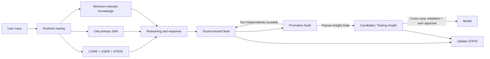

# Personal World Model Harness

[中文](README.md) | [English](README.en.md)

> PWM does not ask AI to build your worldview for you. It puts AI in the role of a cognitive audit assistant, examining how you form, revise, and validate your own mental models.

**AI can work on the cognitive working papers. The human retains final sign-off over durable beliefs.**

## Why I Built This

We live in an age of extreme information abundance and extreme scarcity of attention.

Articles, short videos, social posts, courses, news, and AI answers arrive continuously. They all appear to help us understand the world, yet much of what reaches us is fragmented knowledge or a partial view filtered by platform mechanics, commercial incentives, author perspective, and the purpose of presentation.

When we genuinely want to understand the whole of an issue, we often have to search repeatedly, compare sources, and rebuild the missing background ourselves. The process is slow and fragmented, and it remains difficult to tell where a claim came from, what is fact versus interpretation, whether the material is still current, and which important perspectives never entered our view.

AI dramatically reduces the cost of searching, explaining, and organizing information. It also introduces a new risk: when it keeps producing complete, fluent, persuasive answers, we may gradually absorb its inferences, biases, and framing as our own beliefs without noticing the transition.

The problem is therefore no longer only “How do we obtain more knowledge?” It is:

> **How do we govern the process by which we form knowledge and durable beliefs?**

My background is in finance and auditing, including audit work at a Big Four accounting firm. I am not a traditional software engineer.

In an audit, a number that looks reasonable is not enough. We trace it to its source, inspect working papers, reconcile evidence, identify exceptions, challenge assumptions, document the basis for judgment, and distinguish who prepared the work, who reviewed it, and who ultimately signs and accepts responsibility.

That led me to a question:

> **If financial information needs audit and internal-control mechanisms, might human cognition and durable beliefs need a similar form of governance?**

PWM grew from that question. It gives AI a narrower and more concrete role: work on the “cognitive working papers” before a judgment becomes durable, trace provenance, separate attribution, introduce competing explanations, and flag unvalidated promotion. Which judgments become part of a person's long-term model remains a human decision and responsibility.

PWM is not limited to any profession or field. This public edition distills that personal practice into a reusable harness, governance rules, Markdown templates, and sanitized examples for others to study and adapt.

This repository is a public reference implementation of PWM. It contains only the system philosophy, harness architecture, reusable templates, sanitized examples, and iteration evidence. It contains no real user's private vault.

## Problems It Addresses

When learning, personal experience, external sources, and AI reasoning accumulate in the same long-lived system, ordinary chats and knowledge bases tend to fail in five ways:

1. **Lost provenance and attribution**: source material, AI inference, and the user's own judgment become difficult to distinguish;
2. **State loss**: after a session boundary, the task no longer has a reliable recovery point and old conclusions may overwrite current state;
3. **Context and task collision**: several long-running topics share one conversation while “remember everything” turns into “load everything”;
4. **Mixed responsibilities**: Rules, User, State, Knowledge, and History overwrite one another;
5. **Unvalidated promotion**: a compelling sentence becomes a durable belief without provenance, counterexamples, or real-world testing.

PWM transfers selected audit and internal-control structures into cognitive governance:

| Audit work | PWM mechanism |
|---|---|
| Original records and external evidence | Sources and provenance tracking |
| Audit working papers | Notes that preserve context and attribution |
| Exception detection and review | AI challenge, counterexamples, and competing explanations |
| Layered review and authorization | The Note → Insight → Model promotion gates |
| Final sign-off and accountability | Human approval of core Models |

This transfers a governance structure; it does not borrow audit authority. PWM does not turn AI into a judge of belief. It makes the path to a judgment more inspectable by preserving provenance, dissent, boundaries, and revision history.

PWM addresses these problems with a Markdown-native harness:



## Two Layers of Value

### Layer 1: Guard the judgment process

PWM tries to reduce a subtle risk: fluent AI output, repeatedly presented external information, and our existing commitments can enter durable belief without sufficient validation.

Provenance tracking, attribution separation, competing explanations, and independent challenge make the formation of a conclusion inspectable. PWM does not promise to eliminate bias or automatically break an information bubble. It protects something more basic: the user can still see why they believe a claim and retain the ability to question and revise it.

### Layer 2: Create cognitive compounding

PWM does more than save information or turn conversations into polished notes.

Scattered reading, work experience, real-world observation, and AI discussion first remain in source-bound Notes. Material with independent value is then connected, challenged, tested, and revised through real feedback before it becomes an Insight or Model. Different domains no longer accumulate as separate piles; they continuously revise the same personal world model.

```text
Fragmented information + personal experience
        ↓
Provenance + structured Note
        ↓
AI challenge + competing explanations + boundaries
        ↓
Testable Insight
        ↓
Real-world application + feedback
        ↓
Human approval, revision, or rejection of a Model
```

## Task Routing: Continuity Across Long-Lived Topics

A long-lived cognitive system never contains only one topic. Learning, career judgment, real cases, reading, and system maintenance may all exist at the same time.

One ever-growing conversation creates context pollution. Fully isolated tasks, however, lose global state and cross-domain continuity.

PWM therefore uses:

- one **Hub** for intake, cross-topic coordination, and system governance;
- one **Current Stream** for the active cognitive line of work;
- multiple **Topic Resume Blocks** for local recovery state;
- one shared **Vault** for persistence and cross-topic integration.

System maintenance can happen in the Hub without displacing the cognitive Current Stream. Topics may reason in separate working contexts while still contributing to the same Personal World Model.

Routing does not remove model context limits or provide a standalone multi-task UI. It addresses a different problem: maintaining continuity in a long-lived, multi-topic cognitive system without relying on one infinite transcript.

STATE + Topic Resume recovery is already running in the originating PWM. The separation between cognitive work and system maintenance, automatic navigation across runtimes, and concurrency constraints remain `testing`. See [Task Routing](docs/task-routing.md).

## Core Design

- **Human-owned**: AI may introduce new viewpoints, but the user remains the final validator of core Models;
- **State as truth**: `STATE.md` is the single source of truth for current state;
- **Minimum sufficient context**: each task loads only CORE, USER, STATE, one primary Skill, and genuinely relevant knowledge;
- **Control / Data separation**: stable rules, user preferences, current state, and knowledge assets have separate responsibilities;
- **Promotion by evidence**: a Note does not automatically become an Insight, and an Insight does not automatically become a Model;
- **Independent challenge**: AI must surface hidden assumptions, counterexamples, competing explanations, and failure boundaries;
- **Maintenance restraint**: the long-term value of any new structure must clearly exceed its maintenance and coordination cost.

## Governance First, Automation Second

PWM does not reject tool use, RAG, automatic memory, or future automation. It refuses to use automation to hide unresolved governance problems.

v1 first asks: who may write, where information came from, what may be promoted, who owns the final decision, and how the system can trace and correct its own mistakes. Automation belongs in PWM only when its long-term cognitive value clearly exceeds its maintenance cost and the risk of silent error.

## Why This Is an Agent Harness, Not a Prompt Collection

A prompt answers only: “What should we tell the model this time?” PWM also defines:

- what to load when a task begins;
- which Skill receives control;
- where current state is recovered;
- how user statements and AI inferences remain distinct;
- when to write a Note and when not to promote it;
- which changes require user approval;
- how to record failures, revise rules, and continue testing.

## Repository Structure

```text
.
├─ AGENTS.md
├─ LICENSE
├─ README.en.md
├─ docs/
│  ├─ architecture.md
│  ├─ context-strategy.md
│  ├─ task-routing.md
│  ├─ governance.md
│  ├─ promotion-pipeline.md
│  ├─ iteration-and-evaluation.md
│  └─ publication-checklist.md
├─ template/
│  ├─ AGENTS.md
│  ├─ DATA-LAYER.md
│  └─ 00_System/
│     ├─ CORE.md
│     ├─ USER.md
│     ├─ STATE.md
│     └─ SKILLS/
└─ examples/
   ├─ learning-loop/
   ├─ promotion-audit/
   └─ real-case-film-reflection/
```

## Operational, but Not One-Click Autonomous Software

PWM is not merely a process diagram. With an agent runtime that can follow workspace instructions and operate on Markdown files, it already executes complete loops in a real workspace.

| Runs today | Remains a human responsibility | Not currently provided |
|---|---|---|
| Read CORE / USER / STATE | Initialize personal goals and boundaries | Installer or standalone application |
| Select minimum Context and one Skill | Judge source credibility | Background service or automated ingestion |
| Recover topics, write Notes, update STATE | Resolve value conflicts and major decisions | Standalone multi-task UI |
| Challenge claims and audit candidate promotion | Approve core Models | Automated truth judgment |
| Preserve provenance, attribution, and revision trails | Decide whether maintenance is worthwhile | Default vector database or automated eval suite |

The accurate positioning is:

> **PWM is a Markdown-native Agent Harness already running in a real workspace, but it is not yet a turnkey standalone software product.**

### Minimal Runtime

1. Copy `template/` into a new Markdown workspace;
2. fill in `CORE.md`, `USER.md`, and `STATE.md` according to real needs;
3. use `AGENTS.md` as the Runtime Adapter;
4. select one primary Skill for each task and load only the knowledge that could change the task outcome;
5. run a Promotion Audit when the topic closes, then update STATE.

The template does not depend on Obsidian plugins. Obsidian can serve as the persistent Data Layer, but the same design can be implemented by any agent runtime that can read Markdown, follow workspace instructions, and operate on files.

## Evidence Status

| Status | Meaning | Example |
|---|---|---|
| `validated-in-use` | Repeatedly produced positive value in the originating PWM | minimal context, STATE / Topic Resume recovery, separation of user wording from AI analysis |
| `supported-by-failure` | A real failure supports the direction of the correction | Promotion Audit, separation of responsibilities, separation of cognitive work from system maintenance |
| `testing` | The design is plausible but needs more real invocations | portability of the routing protocol across runtimes, lightweight Note → Insight checks, system iteration log |
| `candidate` | May become a reusable model but has not passed full validation | cross-domain reuse and Model promotion criteria |

The project does not present `testing` rules as “best practices.” See [Iteration and Evaluation](docs/iteration-and-evaluation.md).

## Demos and a Real Run

- [Learning Loop](examples/learning-loop/README.md): from the user's original understanding to a Note, Candidate Insight, and STATE update;
- [Promotion Audit](examples/promotion-audit/README.md): how an audit missed a procedural asset, and how the system revised its rule in response to that failure;
- [Real Case — Film Reflection](examples/real-case-film-reflection/README.en.md): a complete PWM loop from divergent reflection through independent challenge, user validation, structured convergence, differentiated Insight promotion, and STATE update.

## Current Boundaries

- v1 relies primarily on Markdown, Properties, and Links;
- it depends heavily on a compatible agent runtime and sustained human participation;
- the default is a single agent; Multi-Agent is not added for display value;
- it does not provide automated truth judgment;
- it does not guarantee that an Insight is correct, only that its provenance, reasoning, and validation status remain traceable;
- “cognitive audit assistant” describes working papers, review, authorization, and traceability; beliefs have no universal audit standard, and AI is not a truly independent auditor;
- it contains no real personal data, third-party full-text materials, or private history.

## Design Stance

> Forward calculation is the anchor; backward reasoning is the sail.

Run the smallest useful loop in real tasks first. Expand only when recurring friction justifies expansion. A system's completeness cannot be proven by the number of directories or processes it contains. It can only be tested by whether it improves understanding, judgment, application, and self-correction.

## License

This repository is licensed under the [MIT License](LICENSE). Use, copying, modification, distribution, and commercial use are permitted provided that the copyright and license notices are preserved. The project is provided “as is,” without warranty.
