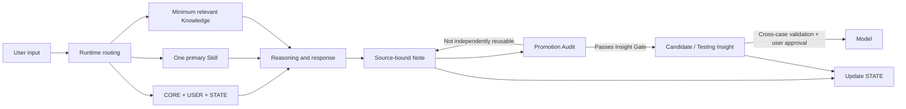

# Personal World Model Harness

[中文](README.md) | [English](README.en.md)

> A human-in-the-loop agent harness for building, testing, and revising a traceable personal world model.

## Why I Built This

My background is in finance and auditing, not traditional software engineering. PWM grew out of real needs in learning, career judgment, and knowledge internalization. With the help of AI agents, I have been building and continuously testing it as a personal cognitive system.

PWM is not limited to any profession or field. This public edition distills that personal practice into a reusable harness, governance rules, and Markdown templates that others can study and adapt to their own cognitive workflows.

PWM does not ask AI to form a worldview on a person's behalf, nor does it automatically dump every conversation into a knowledge base. It addresses a more specific question:

> As learning, personal experience, external sources, and AI reasoning continually enter the same system, how can we preserve provenance and boundaries, recover state across sessions, challenge rather than flatter the user, and let different domains continuously revise the same personal world model?

This repository is a public reference implementation of PWM. It contains only the system philosophy, harness architecture, reusable templates, sanitized examples, and iteration evidence. It contains no real user's private vault.

## Problems It Addresses

Ordinary chat systems and knowledge bases often fail in four ways:

1. **State loss**: after a session boundary, no one knows exactly where the task stopped;
2. **Mixed responsibilities**: Rules, User, State, Knowledge, and History overwrite one another;
3. **Context overload**: loading everything in order to “remember everything” dilutes the information that actually matters;
4. **Unvalidated promotion**: an appealing sentence becomes a durable belief without provenance, counterexamples, or real-world testing.

PWM addresses these problems with a Markdown-native harness:



## Core Design

- **Human-owned**: AI may introduce new viewpoints, but the user remains the final validator of core Models;
- **State as truth**: `STATE.md` is the single source of truth for current state;
- **Minimum sufficient context**: each task loads only CORE, USER, STATE, one primary Skill, and genuinely relevant knowledge;
- **Control / Data separation**: stable rules, user preferences, current state, and knowledge assets have separate responsibilities;
- **Promotion by evidence**: a Note does not automatically become an Insight, and an Insight does not automatically become a Model;
- **Independent challenge**: AI must surface hidden assumptions, counterexamples, competing explanations, and failure boundaries;
- **Maintenance restraint**: the long-term value of any new structure must clearly exceed its maintenance and coordination cost.

## Why This Is an Agent Harness, Not a Prompt Collection

A prompt answers only: “What should we tell the model this time?” PWM also defines:

- what to load when a task begins;
- which Skill receives control;
- where current state is recovered;
- how user statements and AI inferences remain distinct;
- when to write a Note and when not to promote it;
- which changes require user approval;
- how to record failures, revise rules, and continue testing.

## Repository Structure

```text
.
├─ AGENTS.md
├─ LICENSE
├─ README.en.md
├─ docs/
│  ├─ architecture.md
│  ├─ context-strategy.md
│  ├─ governance.md
│  ├─ promotion-pipeline.md
│  ├─ iteration-and-evaluation.md
│  └─ publication-checklist.md
├─ template/
│  ├─ AGENTS.md
│  ├─ DATA-LAYER.md
│  └─ 00_System/
│     ├─ CORE.md
│     ├─ USER.md
│     ├─ STATE.md
│     └─ SKILLS/
└─ examples/
   ├─ learning-loop/
   ├─ promotion-audit/
   └─ real-case-film-reflection/
```

## Minimal Runtime

1. Copy `template/` into a new Markdown workspace;
2. fill in `CORE.md`, `USER.md`, and `STATE.md` according to real needs;
3. use `AGENTS.md` as the Runtime Adapter;
4. select one primary Skill for each task and load only the knowledge that could change the task outcome;
5. run a Promotion Audit when the topic closes, then update STATE.

The template does not depend on Obsidian plugins. Obsidian can serve as the persistent Data Layer, but the same design can be implemented by any agent runtime that can read Markdown, follow workspace instructions, and operate on files.

## Evidence Status

| Status | Meaning | Example |
|---|---|---|
| `validated-in-use` | Repeatedly produced positive value in real operation | minimal context, STATE as the single source of truth, separation of user wording from AI analysis |
| `supported-by-failure` | A real failure supports the direction of the correction | Promotion Audit, separation of responsibilities |
| `testing` | The design is plausible but needs more real invocations | lightweight Note → Insight checks, system iteration log |
| `candidate` | May become a reusable model but has not passed full validation | cross-domain reuse and Model promotion criteria |

The project does not present `testing` rules as “best practices.” See [Iteration and Evaluation](docs/iteration-and-evaluation.md).

## Demos and a Real Run

- [Learning Loop](examples/learning-loop/README.md): from the user's original understanding to a Note, Candidate Insight, and STATE update;
- [Promotion Audit](examples/promotion-audit/README.md): how an audit missed a procedural asset, and how the system revised its rule in response to that failure;
- [Real Case — Film Reflection](examples/real-case-film-reflection/README.md): a complete PWM loop from divergent reflection through independent challenge, user validation, structured convergence, differentiated Insight promotion, and STATE update.

## Current Boundaries

- v1 relies primarily on Markdown, Properties, and Links;
- the default is a single agent; Multi-Agent is not added for display value;
- it does not provide automated truth judgment;
- it does not guarantee that an Insight is correct, only that its provenance, reasoning, and validation status remain traceable;
- it contains no real personal data, third-party full-text materials, or private history.

## Design Stance

> Forward calculation is the anchor; backward reasoning is the sail.

Run the smallest useful loop in real tasks first. Expand only when recurring friction justifies expansion. A system's completeness cannot be proven by the number of directories or processes it contains. It can only be tested by whether it improves understanding, judgment, application, and self-correction.

## License

This repository is licensed under the [MIT License](LICENSE). Use, copying, modification, distribution, and commercial use are permitted provided that the copyright and license notices are preserved. The project is provided “as is,” without warranty.
