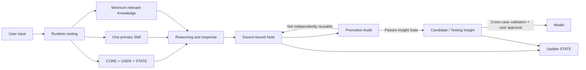

# Personal World Model Harness

[中文](README.md) | [English](README.en.md)

> Not an AI simulation of the world, but an AI-assisted audit of the models you use to understand it.

## Why I Built This

My background is in finance and auditing, not traditional software engineering. PWM grew out of real needs in learning, career judgment, and knowledge internalization. With the help of AI agents, I have been building and continuously testing it as a personal cognitive system.

PWM is not limited to any profession or field. This public edition distills that personal practice into a reusable harness, governance rules, and Markdown templates that others can study and adapt to their own cognitive workflows.

PWM does not ask AI to form a worldview on a person's behalf, nor does it automatically dump every conversation into a knowledge base. It gives AI a more constrained role: work on the cognitive “working papers,” trace provenance, raise counterexamples, and flag unvalidated promotion while the user retains final authority over durable beliefs.

This language borrows from financial audit and internal control, but the analogy is not proof. Beliefs have no universal accounting standard, and AI is not a truly independent auditor. PWM can make a judgment trail more traceable and challengeable; it cannot guarantee that the conclusion is true.

It addresses a more specific question:

> As learning, personal experience, external sources, and AI reasoning continually enter the same system, how can we preserve provenance and boundaries, recover state across sessions, challenge rather than flatter the user, and let different domains continuously revise the same personal world model?

This repository is a public reference implementation of PWM. It contains only the system philosophy, harness architecture, reusable templates, sanitized examples, and iteration evidence. It contains no real user's private vault.

## Problems It Addresses

Ordinary chat systems and knowledge bases often fail in five ways:

1. **State loss**: after a session boundary, no one knows exactly where the task stopped;
2. **Mixed responsibilities**: Rules, User, State, Knowledge, and History overwrite one another;
3. **Context overload**: loading everything in order to “remember everything” dilutes the information that actually matters;
4. **Unvalidated promotion**: an appealing sentence becomes a durable belief without provenance, counterexamples, or real-world testing.
5. **Task collision**: several long-running topics share one conversation until the active focus, local conclusions, and recovery points contaminate one another.

PWM addresses these problems with a Markdown-native harness:



Task routing separates the conversation window from persistent state. New input is classified as a continuation of the current topic, a resumption of an existing topic, or a new / ambiguous / cross-topic item for the Hub. Before a switch, the current topic receives a minimum recovery checkpoint; `STATE.md` then names exactly one Current Stream. This manages context and multi-task recovery. It does not remove model context limits or provide a standalone multi-task UI. See [Task Routing](docs/task-routing.md).

## Two Layers of Value

The first layer protects the judgment process: preserve provenance and attribution, require AI to challenge rather than quietly turn fluent output into user belief, and create better conditions for independent thinking and exposure to competing views.

The second layer creates compounding value: converge scattered discussions into recoverable Notes, then connect, test, and selectively promote reusable material into Insights or Models.

Neither layer is automatic. The first still requires the user to judge; the second still requires real-world feedback and human approval.

## Core Design

- **Human-owned**: AI may introduce new viewpoints, but the user remains the final validator of core Models;
- **State as truth**: `STATE.md` is the single source of truth for current state;
- **Minimum sufficient context**: each task loads only CORE, USER, STATE, one primary Skill, and genuinely relevant knowledge;
- **Control / Data separation**: stable rules, user preferences, current state, and knowledge assets have separate responsibilities;
- **Promotion by evidence**: a Note does not automatically become an Insight, and an Insight does not automatically become a Model;
- **Independent challenge**: AI must surface hidden assumptions, counterexamples, competing explanations, and failure boundaries;
- **Maintenance restraint**: the long-term value of any new structure must clearly exceed its maintenance and coordination cost.

## What It Deliberately Does Not Center

PWM does not center its value proposition on the number of tool calls, vector RAG, automatic capture, or indiscriminate “automatic memory.” v1 focuses on provenance, state, context, authority, and belief promotion. The runtime still reads and writes files, routes tasks, and updates checkpoints. The choice is not “no tools”; it is refusing to treat more automation as better cognitive governance by default.

## Why This Is an Agent Harness, Not a Prompt Collection

A prompt answers only: “What should we tell the model this time?” PWM also defines:

- what to load when a task begins;
- which Skill receives control;
- where current state is recovered;
- how user statements and AI inferences remain distinct;
- when to write a Note and when not to promote it;
- which changes require user approval;
- how to record failures, revise rules, and continue testing.

## Repository Structure

```text
.
├─ AGENTS.md
├─ LICENSE
├─ README.en.md
├─ docs/
│  ├─ architecture.md
│  ├─ context-strategy.md
│  ├─ task-routing.md
│  ├─ governance.md
│  ├─ promotion-pipeline.md
│  ├─ iteration-and-evaluation.md
│  └─ publication-checklist.md
├─ template/
│  ├─ AGENTS.md
│  ├─ DATA-LAYER.md
│  └─ 00_System/
│     ├─ CORE.md
│     ├─ USER.md
│     ├─ STATE.md
│     └─ SKILLS/
└─ examples/
   ├─ learning-loop/
   ├─ promotion-audit/
   └─ real-case-film-reflection/
```

## Operational, but Not One-Click Autonomous Software

PWM is not merely a process diagram. When the template is used with an agent runtime that can follow workspace instructions and read and modify Markdown files, it can execute context selection, task routing, independent challenge, Note capture, Promotion Audits, and STATE updates. The demos and sanitized real run show these loops in operation.

It is also not a packaged standalone application. There is no installer, background service, automated ingestion pipeline, vector database, automated evaluation suite, or cross-platform UI. Initializing CORE / USER / STATE, connecting a compatible runtime, making consequential judgments, and approving promotion still require human effort.

### Minimal Runtime

1. Copy `template/` into a new Markdown workspace;
2. fill in `CORE.md`, `USER.md`, and `STATE.md` according to real needs;
3. use `AGENTS.md` as the Runtime Adapter;
4. select one primary Skill for each task and load only the knowledge that could change the task outcome;
5. run a Promotion Audit when the topic closes, then update STATE.

The template does not depend on Obsidian plugins. Obsidian can serve as the persistent Data Layer, but the same design can be implemented by any agent runtime that can read Markdown, follow workspace instructions, and operate on files.

## Evidence Status

| Status | Meaning | Example |
|---|---|---|
| `validated-in-use` | Repeatedly produced positive value in the originating PWM | minimal context, STATE / Topic Resume recovery, separation of user wording from AI analysis |
| `supported-by-failure` | A real failure supports the direction of the correction | Promotion Audit, separation of responsibilities |
| `testing` | The design is plausible but needs more real invocations | portability of the routing protocol across runtimes, lightweight Note → Insight checks, system iteration log |
| `candidate` | May become a reusable model but has not passed full validation | cross-domain reuse and Model promotion criteria |

The project does not present `testing` rules as “best practices.” See [Iteration and Evaluation](docs/iteration-and-evaluation.md).

## Demos and a Real Run

- [Learning Loop](examples/learning-loop/README.md): from the user's original understanding to a Note, Candidate Insight, and STATE update;
- [Promotion Audit](examples/promotion-audit/README.md): how an audit missed a procedural asset, and how the system revised its rule in response to that failure;
- [Real Case — Film Reflection](examples/real-case-film-reflection/README.en.md): a complete PWM loop from divergent reflection through independent challenge, user validation, structured convergence, differentiated Insight promotion, and STATE update.

## Current Boundaries

- v1 relies primarily on Markdown, Properties, and Links;
- it depends heavily on a compatible agent runtime and sustained human participation;
- the default is a single agent; Multi-Agent is not added for display value;
- it does not provide automated truth judgment;
- it does not guarantee that an Insight is correct, only that its provenance, reasoning, and validation status remain traceable;
- it contains no real personal data, third-party full-text materials, or private history.

## Design Stance

> Forward calculation is the anchor; backward reasoning is the sail.

Run the smallest useful loop in real tasks first. Expand only when recurring friction justifies expansion. A system's completeness cannot be proven by the number of directories or processes it contains. It can only be tested by whether it improves understanding, judgment, application, and self-correction.

## License

This repository is licensed under the [MIT License](LICENSE). Use, copying, modification, distribution, and commercial use are permitted provided that the copyright and license notices are preserved. The project is provided “as is,” without warranty.
