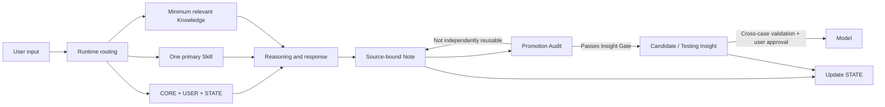

# Personal World Model Harness

[中文](README.md) | [English](README.en.md)

> PWM 不是让 AI 替你建立世界观，而是让 AI 像一名认知审计助理，检查你如何形成、修改和验证自己的心智模型。

**AI 可以处理认知底稿，人类保留信念的最终签字权。**

## 项目缘起

我们生活在一个信息极度丰富、注意力却极度稀缺的时代。

文章、短视频、社交媒体观点、课程、新闻和 AI 回答不断涌到面前。它们看起来都在帮助我们理解世界，但其中很多只是被切割出来的知识碎片，或者经过平台机制、商业利益、创作者立场与表达目的筛选后的局部画面。

当我们真正想了解一件事的全貌时，往往需要自己不断搜索、交叉比较和补齐背景。这个过程耗时、零散，也很难判断：信息最初来自哪里，哪些是事实、哪些只是解释，内容是否已经过时，又有哪些重要视角没有进入我们的视野。

AI 大幅降低了搜索、解释和整理信息的成本，却也带来一个新的风险：当它持续给出完整、流畅、充满说服力的答案时，我们可能在没有意识到的情况下，把它的推断、偏差和表达方式逐渐吸收成自己的信念。

问题因此不再只是“如何获得更多知识”，而是：

> **我们如何管理自己形成知识和信念的过程？**

我有财务与审计背景，也曾在四大会计师事务所从事审计工作，并非传统软件工程师。

在审计中，一个数字看起来合理，并不代表它可以直接被接受。我们需要追溯来源、检查底稿、核对证据、识别异常、挑战假设、记录判断依据，并区分谁负责准备、谁负责复核、谁最终签字并承担责任。

这让我开始思考：

> **如果财务信息需要一套审计与内部控制机制，人的认知和长期信念是否也需要类似的治理过程？**

PWM 由此产生。它让 AI 承担更克制也更具体的工作：处理形成判断之前的“认知底稿”，追踪来源，区分归属，补充竞争解释，检查未经验证的晋升；哪些判断最终成为个人长期信念，仍由用户批准并承担责任。

PWM 的设计并不局限于某一职业或专业。公开版将这段个人实践提炼为可复用的 Harness、治理规则、Markdown 模板与脱敏案例，供有类似认知管理需求的人参考和改造。

本仓库是 PWM 的公开参考实现。它只包含系统思想、Harness 架构、通用模板、脱敏示例和迭代证据，不包含任何真实用户的私人 Vault。

## 它解决什么问题

当学习、个人经验、外部资料和 AI 推理长期进入同一个系统时，普通聊天和知识库容易出现五类失败：

1. **来源与归属丢失**：分不清什么来自原始资料、什么是 AI 推断、什么才是用户自己的判断；
2. **状态丢失**：跨会话后不知道任务进行到哪里，旧结论又可能覆盖新状态；
3. **Context 与任务碰撞**：多个长期话题挤在同一会话里，为了“记住一切”而加载一切；
4. **职责混杂**：Rules、User、State、Knowledge 与 History 相互覆盖；
5. **无验证晋升**：一句漂亮表达未经来源、反例和现实检验，就被写成长期信念。

PWM 把审计与内部控制中的部分方法迁移到认知治理中：

| 审计工作 | PWM 中的对应机制 |
|---|---|
| 原始凭证与外部证据 | Source 与来源追踪 |
| 审计底稿 | 保留上下文和观点归属的 Note |
| 异常识别与复核 | AI 的独立挑战、反例和竞争解释 |
| 分级复核与授权边界 | Note → Insight → Model 的晋升门 |
| 最终签字与责任承担 | 用户对核心 Model 的最终批准权 |

这是一种治理结构的迁移，不是对审计权威的借用。PWM 不把 AI 变成信念裁判，而是让判断过程拥有更清楚的来源、异议、边界和修改记录。

PWM 用一套 Markdown-native Harness 处理这些问题：



## 两层价值

### 第一层：思考守门

PWM 试图降低一种很难察觉的风险：AI 的流畅输出、外部信息的重复呈现，以及我们已有的立场，在缺少验证的情况下逐渐进入长期信念。

它通过来源追踪、归属区分、竞争解释和独立挑战，让用户看见一个结论是如何形成的。它不承诺自动消除偏见或打破信息茧房；它保护的是用户仍然知道自己为什么相信，并保留质疑和修改的能力。

### 第二层：认知复利

PWM 不只保存信息，也不满足于把对话整理成一堆漂亮笔记。

零散的阅读、工作经验、现实观察和 AI 讨论，首先被保存在有来源的 Note 中；真正具有独立价值的部分，再经过关联、反例、验证和现实反馈，逐步形成 Insight 或 Model。不同领域因此不再各自堆积知识，而是不断共同修正同一套个人世界模型。

```text
碎片信息与个人经验
        ↓
来源追踪与结构化 Note
        ↓
AI 挑战、竞争解释与边界检查
        ↓
可检验的 Insight
        ↓
现实应用与结果反馈
        ↓
用户批准、修正或否决 Model
```

## 任务路由：让长期多主题系统保持连续

一套准备长期运行的认知系统，不会只有一个话题。学习、职业判断、现实案例、阅读感悟和系统维护可能同时存在。

如果所有内容都挤在一条无限增长的对话里，Context 会越来越长，不同主题互相污染；如果完全拆散到多个任务，又容易丢失全局状态和跨领域联系。

PWM 因此使用：

- 一个 **Hub**，负责入口、跨主题协调与系统治理；
- 一条 **Current Stream**，保持当前认知主线；
- 多个 **Topic Resume Block**，保存不同主题的局部进度；
- 一个共享 **Vault**，负责跨任务持久化与知识贯通。

系统维护可以在 Hub 中进行，但不会因此抢占正在推进的认知主线。任务可以分开推理，最终仍共同沉淀到同一个 Personal World Model 中。

任务路由不消除模型的 Context 上限，也不提供独立的多任务管理 UI。它解决的是另一个问题：不再依靠一条无限增长的聊天记录，维持一个超长期、多主题认知系统的连续性。

目前，STATE + Topic Resume 的恢复机制已经在原始 PWM 中运行；认知任务与系统维护的分层、跨 Runtime 自动跳转和并发约束仍在 testing。详见 [Task Routing](docs/task-routing.md)。

## 核心设计

- **Human-owned**：AI 可以提出新观点，但用户是核心 Model 的最终 Validator；
- **State as truth**：`STATE.md` 是当前状态唯一真相源；
- **Minimum sufficient context**：每次只加载 CORE、USER、STATE、一个 Skill 和真正相关的知识；
- **Control / Data separation**：稳定规则、用户偏好、当前状态与知识资产职责分离；
- **Promotion by evidence**：Note 不自动等于 Insight，Insight 不自动等于 Model；
- **Independent challenge**：AI 必须指出隐藏假设、反例、竞争解释与失效边界；
- **Maintenance restraint**：新增结构的长期收益必须明显大于维护与协调成本。

## Governance first, automation second

PWM 不排斥工具调用、RAG、自动记忆或未来的自动化，但不会先用自动化掩盖治理问题。

v1 优先解决：谁可以写入、信息来自哪里、什么内容可以晋升、谁拥有最终决定权，以及系统犯错后如何追溯和修正。只有当一种自动化带来的长期认知收益明显大于维护成本和无感错误风险时，它才值得进入 PWM。

## 为什么它是 Agent Harness，而不是 Prompt 合集

Prompt 只回答“这次对模型说什么”。PWM 还定义：

- 任务开始时加载什么；
- 哪一个 Skill 获得控制权；
- 状态在哪里恢复；
- 用户表达与 AI 推断如何分离；
- 什么时候写 Note，什么时候不应晋升；
- 什么修改必须由用户批准；
- 如何记录失败、修正规则并继续验证。

## 仓库结构

```text
.
├─ AGENTS.md
├─ LICENSE
├─ README.en.md
├─ docs/
│  ├─ architecture.md
│  ├─ context-strategy.md
│  ├─ task-routing.md
│  ├─ governance.md
│  ├─ promotion-pipeline.md
│  ├─ iteration-and-evaluation.md
│  └─ publication-checklist.md
├─ template/
│  ├─ AGENTS.md
│  ├─ DATA-LAYER.md
│  └─ 00_System/
│     ├─ CORE.md
│     ├─ USER.md
│     ├─ STATE.md
│     └─ SKILLS/
└─ examples/
   ├─ learning-loop/
   ├─ promotion-audit/
   └─ real-case-film-reflection/
```

## 已经能运行，但不是一键自治软件

PWM 不是只有流程图的概念稿。把模板交给能够读取工作区指令并操作 Markdown 文件的 Agent Runtime 后，它已经可以在真实工作区执行完整闭环。

| 今天已经可以运行 | 仍由人负责 | 当前没有提供 |
|---|---|---|
| 读取 CORE / USER / STATE | 初始化个人目标与边界 | 安装器与独立应用 |
| 选择最小 Context 与一个 Skill | 判断来源是否可信 | 后台服务与自动采集管线 |
| 恢复主题、写入 Note、更新 STATE | 处理价值冲突和重大决定 | 独立多任务 UI |
| 提出挑战并执行候选晋升检查 | 批准核心 Model | 自动真理判断 |
| 保留来源、归属和变更轨迹 | 判断维护成本是否值得 | 默认向量数据库与自动评测集 |

因此，更准确的定位是：

> **PWM 是已经在真实工作区运行的 Markdown-native Agent Harness，但还不是开箱即用的独立软件产品。**

### 最小运行方式

1. 将 `template/` 复制为一个新的 Markdown workspace；
2. 根据真实需要填写 `CORE.md`、`USER.md` 与 `STATE.md`；
3. 把 `AGENTS.md` 作为 Runtime Adapter；
4. 每次任务选择一个主要 Skill，只加载能改变本次任务的相关知识；
5. 话题收束时执行 Promotion Audit，并更新 STATE。

本模板不依赖 Obsidian 插件。Obsidian 可以作为持久化 Data Layer；任何能够读取 Markdown、遵守工作区指令并操作文件的 Agent Runtime 都可以实现同一思路。

## Evidence status

| 状态 | 含义 | 示例 |
|---|---|---|
| `validated-in-use` | 已在原始 PWM 的真实运行中反复产生正向价值 | 最小 Context、STATE / Topic Resume 恢复、用户原话与 AI 分析分离 |
| `supported-by-failure` | 有真实失败案例支持修正方向 | Promotion Audit、职责分离、认知主线与系统维护分层 |
| `testing` | 设计合理但仍需更多真实调用验证 | 路由协议的跨 Runtime 可移植性、Note → Insight 轻量检查、系统迭代日志 |
| `candidate` | 可能成为通用模型，尚未通过完整验证 | 跨领域复用与模型晋升标准 |

项目不会把 `testing` 规则包装成“最佳实践”。详见 [Iteration and Evaluation](docs/iteration-and-evaluation.md)。

## Demo 与真实运行案例

- [Learning Loop](examples/learning-loop/README.md)：从用户原始理解到 Note、Candidate Insight 与 STATE 更新；
- [Promotion Audit](examples/promotion-audit/README.md)：一次审计如何遗漏程序性资产，以及系统如何根据失败修正规则；
- [《欢迎来龙餐馆》真实运行案例](examples/real-case-film-reflection/README.md)：从发散观后感出发，经过独立挑战、用户验证、结构化收束、差异化 Insight 晋升与 STATE 更新，完整展示一次 PWM 闭环。

## 当前边界

- v1 以 Markdown、Properties 与 Links 为主；
- 高度依赖兼容的 Agent Runtime 与人的持续投入；
- 默认单 Agent，不为了展示而增加 Multi-Agent；
- 不提供自动真理判断；
- 不保证 Insight 一定正确，只保证其来源、推理与验证状态可追溯；
- “认知审计助理”解释的是底稿、复核、授权和追溯结构；个人信念没有统一审计准则，AI 也不具备真正的审计独立性；
- 不包含真实个人数据、第三方全文资料或私有历史。

## Design stance

> 正算是锚，倒推是帆。

先让最小闭环在真实任务中运行，再由反复出现的摩擦决定是否扩展。系统的完整性不能由目录和流程数量证明，只能由它是否提高理解、判断、应用和修正能力来检验。

## License

本仓库采用 [MIT License](LICENSE)。允许使用、复制、修改、分发和商业使用，但必须保留版权与许可证声明；项目按“现状”提供，不附带保证。
