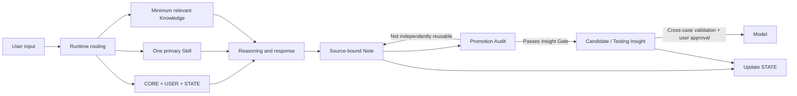

# Personal World Model Harness

[中文](README.md) | [English](README.en.md)

> 不是让 AI 模拟世界，而是让 AI 协助审计你用来理解世界的模型。

## 项目缘起

我有财务与审计背景，并非传统软件工程师。PWM 是我从真实的学习、职业判断和知识内化需求出发，借助 AI Agent 逐步搭建并持续验证的一套个人认知系统。

PWM 的设计并不局限于某一职业或专业。公开版将这段个人实践提炼为可复用的 Harness、治理规则和 Markdown 模板，供有类似认知管理需求的人参考与改造。

PWM 不是让 AI 替人形成世界观，也不是把所有对话自动存进知识库。它把 AI 放在一个更克制的位置：处理认知“底稿”，追踪来源，提出反例，检查未经验证的晋升；用户保留信念的终审权。

这个设计借用了财务审计与内部控制的语言，但类比不是证明。信念没有统一会计准则，AI 也不具备真正的审计独立性。PWM 能做的是让判断过程更可追溯、更容易被挑战，不能保证结论为真。

它尝试解决一个更具体的问题：

> 当学习、个人经验、外部资料和 AI 推理不断进入同一个系统时，如何保留来源与边界，恢复跨会话状态，挑战而非迎合用户，并让不同领域持续修正同一套个人世界模型？

本仓库是 PWM 的公开参考实现。它只包含系统思想、Harness 架构、通用模板、脱敏示例和迭代证据，不包含任何真实用户的私人 Vault。

## 它解决什么问题

普通聊天和知识库经常出现五类失败：

1. **状态丢失**：跨会话后不知道任务进行到哪里；
2. **职责混杂**：Rules、User、State、Knowledge 与 History 相互覆盖；
3. **Context 过载**：为了“记住一切”而加载一切，真正重要的信息反而被稀释；
4. **无验证晋升**：一句漂亮表达被直接写成长期信念，缺少来源、反例和现实检验。
5. **任务碰撞**：多个长期话题挤在同一会话里，当前焦点、局部结论和恢复入口互相污染。

PWM 用一套 Markdown-native Harness 处理这些问题：



任务路由把“对话窗口”与“持久状态”分开：新输入先判断是继续当前主题、恢复已有主题，还是进入 Hub 处理新的 / 模糊的 / 跨主题问题；切换前先为当前主题写最小恢复点，再由 `STATE.md` 指定唯一 Current Stream。它管理 Context 与多任务恢复，但不消除模型窗口上限，也不提供独立的多任务 UI。详见 [Task Routing](docs/task-routing.md)。

## 两层价值

PWM 的第一层目标是保护判断过程：保留来源和归属，让 AI 主动挑战而不是潜移默化地把流畅输出写成用户信念，为独立思考和打破信息茧房创造条件。

第二层目标是形成复利：把零散讨论收束为可恢复的 Note，把真正可复用的部分关联、检验并逐步沉淀为 Insight 或 Model。

这两层都不是自动发生的。第一层仍依赖用户参与判断，第二层仍依赖现实反馈与人工晋升。

## 核心设计

- **Human-owned**：AI 可以提出新观点，但用户是核心 Model 的最终 Validator；
- **State as truth**：`STATE.md` 是当前状态唯一真相源；
- **Minimum sufficient context**：每次只加载 CORE、USER、STATE、一个 Skill 和真正相关的知识；
- **Control / Data separation**：稳定规则、用户偏好、当前状态与知识资产职责分离；
- **Promotion by evidence**：Note 不自动等于 Insight，Insight 不自动等于 Model；
- **Independent challenge**：AI 必须指出隐藏假设、反例、竞争解释与失效边界；
- **Maintenance restraint**：新增结构的长期收益必须明显大于维护与协调成本。

## 它刻意不以什么为中心

PWM 不以工具调用数量、向量 RAG、自动抓取或无差别“自动记忆”为主要卖点。v1 优先处理来源、状态、Context、权责与信念晋升问题。Runtime 仍会读写文件、路由任务和更新检查点；这里的取舍不是“完全不用工具”，而是不把更多自动化误当成更好的认知治理。

## 为什么它是 Agent Harness，而不是 Prompt 合集

Prompt 只回答“这次对模型说什么”。PWM 还定义：

- 任务开始时加载什么；
- 哪一个 Skill 获得控制权；
- 状态在哪里恢复；
- 用户表达与 AI 推断如何分离；
- 什么时候写 Note，什么时候不应晋升；
- 什么修改必须由用户批准；
- 如何记录失败、修正规则并继续验证。

## 仓库结构

```text
.
├─ AGENTS.md
├─ LICENSE
├─ README.en.md
├─ docs/
│  ├─ architecture.md
│  ├─ context-strategy.md
│  ├─ task-routing.md
│  ├─ governance.md
│  ├─ promotion-pipeline.md
│  ├─ iteration-and-evaluation.md
│  └─ publication-checklist.md
├─ template/
│  ├─ AGENTS.md
│  ├─ DATA-LAYER.md
│  └─ 00_System/
│     ├─ CORE.md
│     ├─ USER.md
│     ├─ STATE.md
│     └─ SKILLS/
└─ examples/
   ├─ learning-loop/
   ├─ promotion-audit/
   └─ real-case-film-reflection/
```

## 已经能运行，但不是一键自治软件

PWM 不是只有流程图的概念稿。把模板交给能够读取工作区指令、读取和修改 Markdown 文件的 Agent Runtime 后，它可以实际执行 Context 选择、任务路由、独立挑战、Note 沉淀、Promotion Audit 与 STATE 更新。本仓库的 Demo 和脱敏真实案例展示了这些闭环。

它目前也不是打包完成的独立应用：没有安装器、后台服务、自动采集管线、向量数据库、自动评测集或跨平台 UI。初始化 CORE / USER / STATE、连接兼容 Runtime、关键判断和最终晋升仍需人工参与。

### 最小运行方式

1. 将 `template/` 复制为一个新的 Markdown workspace；
2. 根据真实需要填写 `CORE.md`、`USER.md` 与 `STATE.md`；
3. 把 `AGENTS.md` 作为 Runtime Adapter；
4. 每次任务选择一个主要 Skill，只加载能改变本次任务的相关知识；
5. 话题收束时执行 Promotion Audit，并更新 STATE。

本模板不依赖 Obsidian 插件。Obsidian 可以作为持久化 Data Layer；任何能够读取 Markdown、遵守工作区指令并操作文件的 Agent Runtime 都可以实现同一思路。

## Evidence status

| 状态 | 含义 | 示例 |
|---|---|---|
| `validated-in-use` | 已在原始 PWM 的真实运行中反复产生正向价值 | 最小 Context、STATE / Topic Resume 恢复、用户原话与 AI 分析分离 |
| `supported-by-failure` | 有真实失败案例支持修正方向 | Promotion Audit、职责分离 |
| `testing` | 设计合理但仍需更多真实调用验证 | 路由协议的跨 Runtime 可移植性、Note → Insight 轻量检查、系统迭代日志 |
| `candidate` | 可能成为通用模型，尚未通过完整验证 | 跨领域复用与模型晋升标准 |

项目不会把 `testing` 规则包装成“最佳实践”。详见 [Iteration and Evaluation](docs/iteration-and-evaluation.md)。

## Demo 与真实运行案例

- [Learning Loop](examples/learning-loop/README.md)：从用户原始理解到 Note、Candidate Insight 与 STATE 更新；
- [Promotion Audit](examples/promotion-audit/README.md)：一次审计如何遗漏程序性资产，以及系统如何根据失败修正规则；
- [《欢迎来龙餐馆》真实运行案例](examples/real-case-film-reflection/README.md)：从发散观后感出发，经过独立挑战、用户验证、结构化收束、差异化 Insight 晋升与 STATE 更新，完整展示一次 PWM 闭环。

## 当前边界

- v1 以 Markdown、Properties 与 Links 为主；
- 高度依赖兼容的 Agent Runtime 与人的持续投入；
- 默认单 Agent，不为了展示而增加 Multi-Agent；
- 不提供自动真理判断；
- 不保证 Insight 一定正确，只保证其来源、推理与验证状态可追溯；
- 不包含真实个人数据、第三方全文资料或私有历史。

## Design stance

> 正算是锚，倒推是帆。

先让最小闭环在真实任务中运行，再由反复出现的摩擦决定是否扩展。系统的完整性不能由目录和流程数量证明，只能由它是否提高理解、判断、应用和修正能力来检验。

## License

本仓库采用 [MIT License](LICENSE)。允许使用、复制、修改、分发和商业使用，但必须保留版权与许可证声明；项目按“现状”提供，不附带保证。
