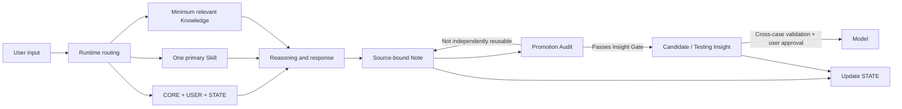

# Personal World Model Harness

> A human-in-the-loop agent harness for building, testing and revising a traceable personal world model.

## 项目缘起

我有财务与审计背景，并非传统软件工程师。PWM 是我从真实的学习、职业判断和知识内化需求出发，借助 AI Agent 逐步搭建并持续验证的一套个人认知系统。

PWM 的设计并不局限于某一职业或专业。公开版将这段个人实践提炼为可复用的 Harness、治理规则和 Markdown 模板，供有类似认知管理需求的人参考与改造。

PWM 不是让 AI 替人形成世界观，也不是把所有对话自动存进知识库。它尝试解决一个更具体的问题：

> 当学习、个人经验、外部资料和 AI 推理不断进入同一个系统时，如何保留来源与边界，恢复跨会话状态，挑战而非迎合用户，并让不同领域持续修正同一套个人世界模型？

本仓库是 PWM 的公开参考实现。它只包含系统思想、Harness 架构、通用模板、脱敏示例和迭代证据，不包含任何真实用户的私人 Vault。

## 它解决什么问题

普通聊天和知识库经常出现四类失败：

1. **状态丢失**：跨会话后不知道任务进行到哪里；
2. **职责混杂**：Rules、User、State、Knowledge 与 History 相互覆盖；
3. **Context 过载**：为了“记住一切”而加载一切，真正重要的信息反而被稀释；
4. **无验证晋升**：一句漂亮表达被直接写成长期信念，缺少来源、反例和现实检验。

PWM 用一套 Markdown-native Harness 处理这些问题：



## 核心设计

- **Human-owned**：AI 可以提出新观点，但用户是核心 Model 的最终 Validator；
- **State as truth**：`STATE.md` 是当前状态唯一真相源；
- **Minimum sufficient context**：每次只加载 CORE、USER、STATE、一个 Skill 和真正相关的知识；
- **Control / Data separation**：稳定规则、用户偏好、当前状态与知识资产职责分离；
- **Promotion by evidence**：Note 不自动等于 Insight，Insight 不自动等于 Model；
- **Independent challenge**：AI 必须指出隐藏假设、反例、竞争解释与失效边界；
- **Maintenance restraint**：新增结构的长期收益必须明显大于维护与协调成本。

## 为什么它是 Agent Harness，而不是 Prompt 合集

Prompt 只回答“这次对模型说什么”。PWM 还定义：

- 任务开始时加载什么；
- 哪一个 Skill 获得控制权；
- 状态在哪里恢复；
- 用户表达与 AI 推断如何分离；
- 什么时候写 Note，什么时候不应晋升；
- 什么修改必须由用户批准；
- 如何记录失败、修正规则并继续验证。

## 仓库结构

```text
.
├─ AGENTS.md
├─ docs/
│  ├─ architecture.md
│  ├─ context-strategy.md
│  ├─ governance.md
│  ├─ promotion-pipeline.md
│  ├─ iteration-and-evaluation.md
│  └─ publication-checklist.md
├─ template/
│  ├─ AGENTS.md
│  ├─ DATA-LAYER.md
│  └─ 00_System/
│     ├─ CORE.md
│     ├─ USER.md
│     ├─ STATE.md
│     └─ SKILLS/
└─ examples/
   ├─ learning-loop/
   └─ promotion-audit/
```

## 最小运行方式

1. 将 `template/` 复制为一个新的 Markdown workspace；
2. 根据真实需要填写 `CORE.md`、`USER.md` 与 `STATE.md`；
3. 把 `AGENTS.md` 作为 Runtime Adapter；
4. 每次任务选择一个主要 Skill，只加载能改变本次任务的相关知识；
5. 话题收束时执行 Promotion Audit，并更新 STATE。

本模板不依赖 Obsidian 插件。Obsidian 可以作为持久化 Data Layer；任何能够读取 Markdown、遵守工作区指令并操作文件的 Agent Runtime 都可以实现同一思路。

## Evidence status

| 状态 | 含义 | 示例 |
|---|---|---|
| `validated-in-use` | 已在真实运行中反复产生正向价值 | 最小 Context、STATE 单一真相源、用户原话与 AI 分析分离 |
| `supported-by-failure` | 有真实失败案例支持修正方向 | Promotion Audit、职责分离 |
| `testing` | 设计合理但仍需更多真实调用验证 | Note → Insight 轻量检查、系统迭代日志 |
| `candidate` | 可能成为通用模型，尚未通过完整验证 | 跨领域复用与模型晋升标准 |

项目不会把 `testing` 规则包装成“最佳实践”。详见 [Iteration and Evaluation](docs/iteration-and-evaluation.md)。

## 两个脱敏 Demo

- [Learning Loop](examples/learning-loop/README.md)：从用户原始理解到 Note、Candidate Insight 与 STATE 更新；
- [Promotion Audit](examples/promotion-audit/README.md)：一次审计如何遗漏程序性资产，以及系统如何根据失败修正规则。

## 当前边界

- v1 以 Markdown、Properties 与 Links 为主；
- 默认单 Agent，不为了展示而增加 Multi-Agent；
- 不提供自动真理判断；
- 不保证 Insight 一定正确，只保证其来源、推理与验证状态可追溯；
- 不包含真实个人数据、第三方全文资料或私有历史。

## Design stance

> 正算是锚，倒推是帆。

先让最小闭环在真实任务中运行，再由反复出现的摩擦决定是否扩展。系统的完整性不能由目录和流程数量证明，只能由它是否提高理解、判断、应用和修正能力来检验。

## License

License 尚未确定。公开发布前需要明确代码式模板与说明性内容的使用许可。
