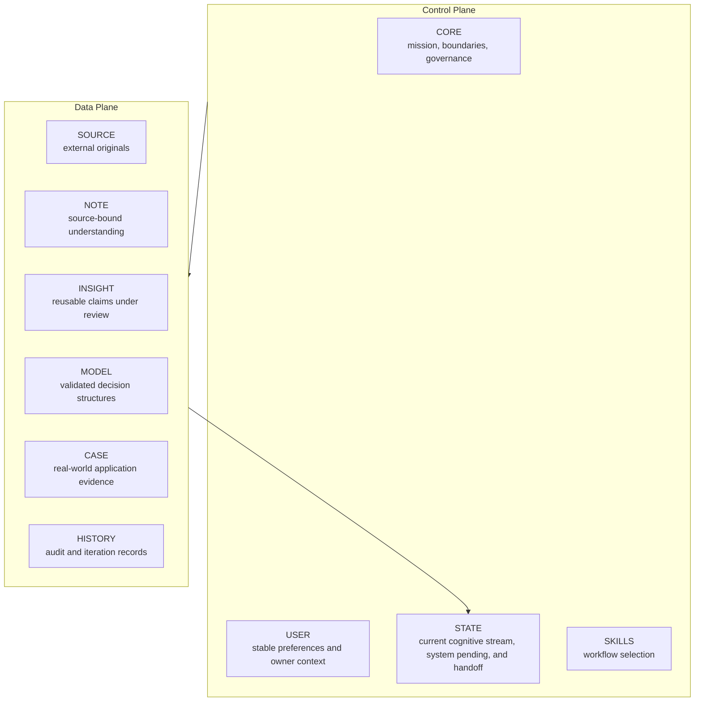

# Architecture

## 1. North Star

PWM 的目标不是保存最多信息，而是让来自不同领域的知识与经验不断修正同一套可追溯、可挑战、可验证的个人世界模型。

```text
External knowledge + personal experience
                  ↓
Understand → challenge → connect → apply → observe
                  ↓
        revise the same world model
```

## 2. Control Plane / Data Plane



Control Plane 决定“系统如何运行”；Data Plane 保存“系统知道什么、如何得知、验证到什么程度”。

## 3. Single source of truth

`STATE.md` 是当前认知进度、开放问题、下一动作、系统尾项和 handoff 的唯一权威来源。

历史日志可以解释过去发生过什么，但不能覆盖当前 STATE；Note 可以记录某次讨论，但不能自行宣布当前任务已经改变。

PWM 把全局状态与话题恢复点分开：

- `STATE.md` 只声明一个认知 Current Stream，并列出可恢复的 Parked Streams；
- 每个 Topic Note 的 Resume Block 只负责该话题的最后结论、开放问题和最小恢复 Context；
- Topic Note 不能越权宣布自己是全局当前任务。
- 架构、配置、迁移和发布维护留在 Hub，并在 System Pending 或相关系统记录中追踪，不因发生维护就替换认知 Current Stream。

这个分层让不同主题可以拥有独立工作视图，同时避免多个主题同时修改共享状态。详见 [Task Routing](task-routing.md)。

## 4. Runtime compilation

完整设计文档类似 source design；每次任务的 Context 类似编译后的最小运行配置：

```text
Design source
    ↓ compile by task
CORE + USER + STATE + one Skill + minimum relevant Knowledge
    ↓
Current reasoning
```

系统不默认加载全部历史、所有 Skills、整个 Blueprint 或全量知识库。

## 5. Human ownership

AI 可以：

- 引入资料和竞争解释；
- 挑战用户判断；
- 提出 Candidate Insight / Model；
- 建议修改和验证方法。

AI 不可以：

- 把 AI 观点写成用户观点；
- 用完整答案替代用户理解；
- 未经批准修改核心 Model；
- 以表达精炼程度代替证据。

## 6. Cognitive flow and system-maintenance flow

认知主题进入完整的理解、挑战、沉淀和晋升流程：

```text
User input
  → route task
  → load minimum context
  → reason and challenge
  → create source-bound Note
  → audit reusable artifacts
  → test / promote / keep in Note
  → update STATE
```

当输入属于另一个已有主题时，路由发生在加载知识之前：先为当前主题写恢复点，再切换 STATE，然后只加载目标主题所需的最小 Context。这样，长会话被拆成可恢复的主题工作集，而不是把所有历史重新塞回一个窗口。

系统维护使用更短的控制流：

```text
System / publishing / configuration input
  → keep in Hub
  → load only relevant system files
  → make and verify the bounded change
  → update System Pending or History only when material
  → keep the cognitive Current Stream unchanged
```

系统维护不因完成而自动执行完整的认知 Promotion Audit。只有独立于配置或宣传产物、单独通过 Insight Gate 的命题，才进入 Candidate Insight 审查。

## 7. v1 restraint

只有当长期认知或运行收益明显大于维护与协调成本时，才增加 Agent、Skill、Property、目录、规则或自动化。

如果维护系统开始频繁打断学习、思考和应用，默认动作是减结构，而不是继续补结构。

## 8. Operational boundary

这是一套由 Agent Runtime 执行的声明式 Harness，不是独立软件包。当前模板能指导兼容 Runtime 读写 Markdown、路由任务、选择 Context、沉淀资产与更新状态；它不包含安装器、常驻进程、自动采集、向量检索服务、自动评测或多任务 UI。

因此，“可运行”指闭环已能在真实 Agent 工作区中执行；不指无需配置、无需人工判断或可脱离 Runtime 自主运行。
