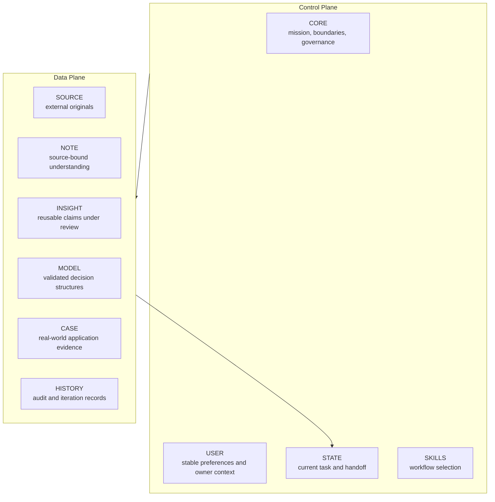

# Architecture

## 1. North Star

PWM 的目标不是保存最多信息，而是让来自不同领域的知识与经验不断修正同一套可追溯、可挑战、可验证的个人世界模型。

```text
External knowledge + personal experience
                  ↓
Understand → challenge → connect → apply → observe
                  ↓
        revise the same world model
```

## 2. Control Plane / Data Plane



Control Plane 决定“系统如何运行”；Data Plane 保存“系统知道什么、如何得知、验证到什么程度”。

## 3. Single source of truth

`STATE.md` 是当前进度、开放问题、下一动作和 handoff 的唯一权威来源。

历史日志可以解释过去发生过什么，但不能覆盖当前 STATE；Note 可以记录某次讨论，但不能自行宣布当前任务已经改变。

## 4. Runtime compilation

完整设计文档类似 source design；每次任务的 Context 类似编译后的最小运行配置：

```text
Design source
    ↓ compile by task
CORE + USER + STATE + one Skill + minimum relevant Knowledge
    ↓
Current reasoning
```

系统不默认加载全部历史、所有 Skills、整个 Blueprint 或全量知识库。

## 5. Human ownership

AI 可以：

- 引入资料和竞争解释；
- 挑战用户判断；
- 提出 Candidate Insight / Model；
- 建议修改和验证方法。

AI 不可以：

- 把 AI 观点写成用户观点；
- 用完整答案替代用户理解；
- 未经批准修改核心 Model；
- 以表达精炼程度代替证据。

## 6. Data flow

```text
User input
  → route task
  → load minimum context
  → reason and challenge
  → create source-bound Note
  → audit reusable artifacts
  → test / promote / keep in Note
  → update STATE
```

## 7. v1 restraint

只有当长期认知或运行收益明显大于维护与协调成本时，才增加 Agent、Skill、Property、目录、规则或自动化。

如果维护系统开始频繁打断学习、思考和应用，默认动作是减结构，而不是继续补结构。
