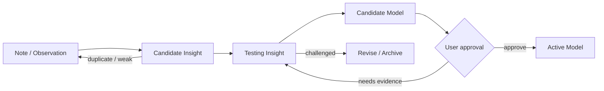

# Promotion Pipeline

## Flow

## Why promotion exists

漂亮表达容易造成一种错觉：写得越完整，越像真理。Promotion Gate 把表达质量与证据等级分开。

## Insight Gate

Candidate Insight 至少需要：

- 是一个可独立陈述的判断，而非来源摘录；
- 推理链可以说明；
- 可追溯到来源、观察或 Case；
- 已检查至少一个反例或边界；
- 已说明与现有 Insight / Model 的关系；
- 脱离原 Topic Note 后仍具有独立调用价值。

## Model Gate

Candidate Model 至少需要：

- 两个相互独立的来源、领域或现实场景；
- 明确适用条件与失效边界；
- 支持 Case，并处理反例或竞争解释；
- 能指导预测、判断或行动；
- 相对现有模型具有信息增量；
- 用户明确批准。

## Promotion Audit

话题或任务有效收束时，扫描：

- 新 State；
- Source-bound understanding；
- declarative insight；
- causal mechanism；
- judgment / decision model；
- diagnostic checklist；
- reusable workflow；
- real-world Case；
- stable preference。

扫描不是产出配额。没有合格资产时，应明确记录“无晋升”，而不是为了闭环制造 Insight。

## Current testing problem

有价值的完整回复适合进入 Note，但并不都值得拆成 Insight。v1 正在测试五个轻量问题：

1. 是否具有独立调用价值？
2. 是否可能跨场景复用？
3. 是否与现有资产重复？
4. 是否具有推理、边界和验证方式？
5. 单独建档的价值是否大于维护成本？

这些问题目前是 testing heuristic，不是机械评分表。
