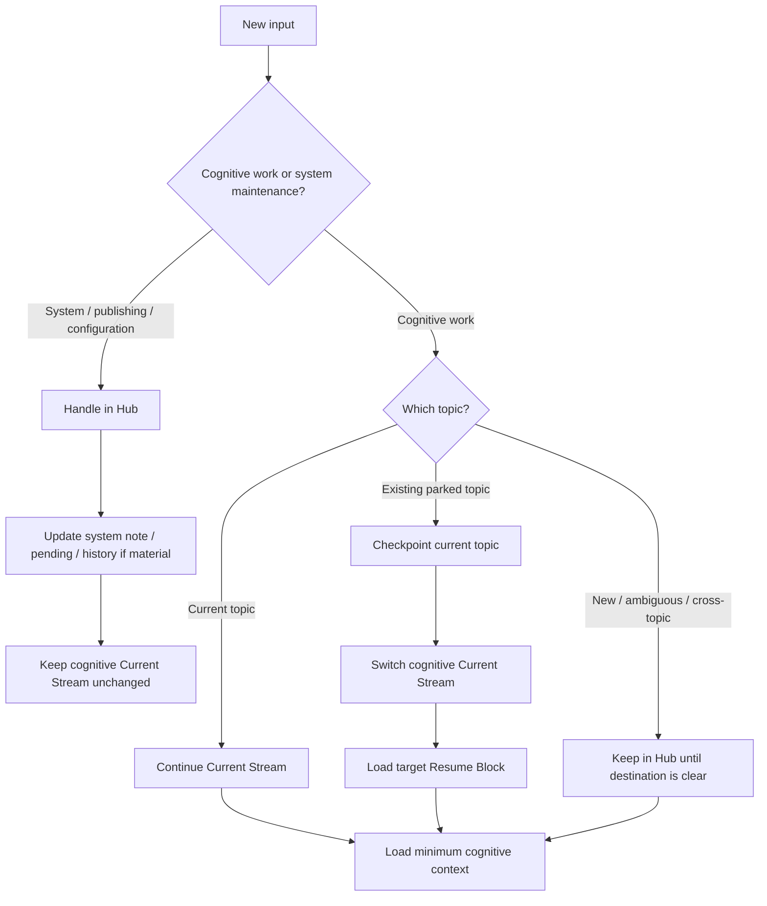

# Task Routing / 任务路由

## 中文

### 它解决的不是“窗口更大”，而是“工作集不再混在一起”

一个超长期系统会同时存在学习、研究、现实决策和系统维护。如果这些内容只依赖单一聊天记录，Context 越长，任务边界越模糊；如果完全分散到多个会话，又容易丢失全局状态和跨领域联系。

PWM 使用两层状态解决这个张力：

- `STATE.md` 是全局控制面，只允许一个认知 Current Stream，并把系统维护记录在独立的 System Pending 中；
- Topic Note 的 Resume Block 是局部恢复点，保存该主题的最后结论、开放问题、最小 Context 和边界。

会话或任务可以作为不同主题的“视图”，Vault 才是跨会话的持久层。Runtime 不靠重读完整聊天恢复，而是从 STATE 与目标 Resume Block 编译本轮工作集。

### 路由决策



只有认知主题之间的切换才修改 Current Stream。切换必须先 checkpoint，再修改 `STATE.md`。直接回复一个 parked topic 表示用户想切换，但不允许 Runtime 忽略当前主题的恢复责任。

架构、Runtime 治理、Obsidian / Repository 配置、迁移、GitHub Public Edition 和发布维护留在 Hub。它们可以更新系统记录，但不会因为步骤多或耗时长就抢占认知主线，也不会仅因工作完成就执行完整的认知 Promotion Audit。

### 为什么它同时改善 Context 与多任务视图

- 每个主题只携带自己的局部恢复 Context，减少长历史噪声；
- STATE 明确唯一当前流，避免两个主题同时改写共享资产；
- Parked Streams 保留多任务地图，Topic Note 保留每个任务的局部进度；
- Hub 同时承担入口、跨主题协调与系统治理，但不代替主题任务进行长期认知深挖。

### 边界与证据状态

- **已在原始 PWM 中运行**：STATE + Topic Resume 的恢复、Hub 到已有认知主题的路由和切换前 checkpoint；
- **有真实失败支持的修正**：系统维护不能替换认知 Current Stream，作品展示不能自动触发完整认知 Promotion Audit；
- **仍在 testing**：认知任务与系统维护的分层能否长期稳定，以及不同 Agent Runtime 是否能一致执行自动跳转、跨任务消息转交和并发约束；
- **不提供**：独立任务管理 UI、无限 Context、冲突自动合并，或多个 Current Stream 的安全并行写入。

任务路由是一项治理协议。支持任务 / 会话操作的平台可以把它自动化；不支持的平台仍可手工执行同一状态转换。

---

## English

### The goal is not a larger window, but separate working sets

A long-lived system contains learning, research, real decisions, and system maintenance at the same time. One ever-growing chat blurs task boundaries; fully separate chats lose global state and cross-domain continuity.

PWM uses two state layers:

- `STATE.md` is the global control plane, names exactly one cognitive Current Stream, and keeps system maintenance in a separate System Pending section;
- each Topic Note has a Resume Block containing that topic's last conclusion, open question, minimum context, and boundaries.

Tasks or conversations can act as topic views, while the Vault remains the persistent cross-session layer. Recovery compiles a working set from STATE and the target Resume Block instead of replaying the full transcript.

### Routing sequence

Input is first classified as cognitive work or system maintenance. Architecture, runtime governance, Obsidian / repository configuration, migration, Public Edition, and publishing remain in the Hub. They may update system notes, pending state, or History, but they do not displace the cognitive Current Stream merely because they take several steps.

Cognitive input is then classified as current-topic continuation, an existing parked topic, or new / ambiguous / cross-topic input for the Hub. A cognitive topic switch follows this order:

```text
checkpoint current topic
        → update STATE Current Stream
        → load target Resume Block
        → select one primary Skill
        → load minimum relevant knowledge
```

A direct reply inside a parked topic signals intent to switch. It does not remove the runtime's duty to preserve a recovery point for the current topic first.

Finishing system maintenance does not trigger the full cognitive Promotion Audit by default. A Candidate Insight is extracted only when it has independent value outside the operational artifact and separately passes the Insight Gate.

### Why this helps both context and multi-task work

- Each topic carries only its local recovery context;
- STATE keeps one current stream, preventing concurrent mutation of shared assets;
- Parked Streams provide the global task map while Topic Notes preserve local progress;
- the Hub handles intake, cross-topic coordination, and system governance without replacing deep cognitive topic work.

### Boundaries and evidence status

- **Running in the originating PWM**: STATE + Topic Resume recovery, Hub-to-existing-cognitive-topic routing, and checkpoint-before-switch;
- **Correction supported by a real failure**: system maintenance must not replace the cognitive Current Stream, and portfolio work must not automatically trigger the full cognitive Promotion Audit;
- **Still testing**: whether the cognitive / system split remains stable over time, plus automatic navigation, message handoff, and concurrency control across different agent runtimes;
- **Not provided**: a standalone task UI, unlimited context, automatic conflict merging, or safe concurrent writes from multiple Current Streams.

Task routing is a governance protocol. Platforms with task / conversation controls can automate it; other runtimes can perform the same state transition manually.
